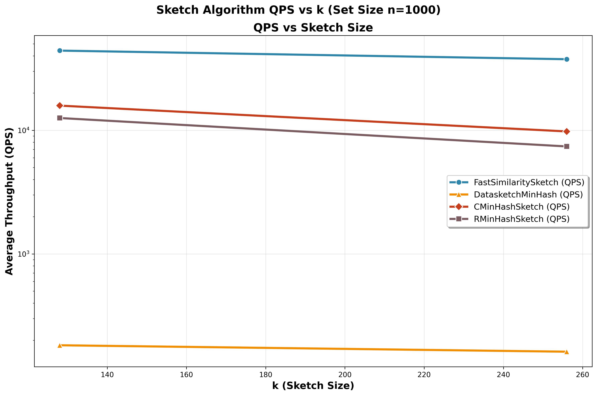

# FastSketchLSH

## Introduction
FastSketchLSH delivers a Python-first package that wraps a high-performance C++/SIMD implementation of Fast Similarity Sketch. The goal is to make Jaccard estimation and locality-sensitive hashing (LSH) practical for large token sets such as document shingles, embeddings, or near-duplicate checkpoints.



### Headline Results
- `FastSimilaritySketch` maintains **sub-millisecond** sketch times even when each set holds **1 600 tokens**, keeping the absolute Jaccard error around **0.03–0.06**.
- At the sketch level, FastSimilaritySketch stays **200×–990× faster** than `datasketch` MinHash and still **8×–23×** faster than Rensa’s `CMinHash`/`RMinHash`, while matching their accuracy—these gains matter most for large documents.
- End-to-end deduplication experiments show FastSketchLSH is typically **2×–3.5× faster** than Rensa in single-thread runs.
- Ground-truth comparisons confirm FastSketchLSH matches or slightly exceeds the deduplication accuracy of both Rensa and datasketch.

## How It Works
- **Fast Similarity Sketching**: SIMD-accelerated permutations compress a set into a fixed-length signature, expected time `O(n + k log k)` with `O(k)` space.
- **Banded LSH**: Signature rows are grouped into bands; items colliding in any band become candidates for deduplication.
- **Python ergonomics**: Thin wrappers expose the C++ core, plus reference implementations of competing sketches for fair comparisons.

## Installation
1. Build the native extension:
   ```bash
   cd fastsketchlsh_ext
   pip install .
   ```
   This installs the `FastSketchLSH` Python module with SIMD kernels.
2. Install benchmark utilities (optional for reproducing experiments):
   ```bash
   pip install -r requirements.txt
   ```
3. Activate your environment (e.g. `source .venv/bin/activate`) before running scripts.

## Quick Start
### Sketch two sets and estimate their Jaccard similarity
```python
from FastSketchLSH import FastSimilaritySketch, estimate_jaccard

# Build list_a with 16,000 tokens labeled "a-0" to "a-15999"
# Build list_b with 8,000 overlapping + 8,000 new tokens (true Jaccard = 1/3)
list_a = [f"a-{i}" for i in range(16_000)]
list_b = [f"a-{i}" for i in range(8_000)] + [f"b-{i}" for i in range(8_000)]

sketcher = FastSimilaritySketch(sketch_size=256)
sig_a = sketcher.sketch(list_a)
sig_b = sketcher.sketch(list_b)

estimated = estimate_jaccard(sig_a, sig_b)
print(f"Estimated Jaccard similarity: {estimated:.4f}")
```


### Approximate Deduplication with LSH
```python
from typing import Iterable, List

from FastSketchLSH import FastSimilaritySketch
from prototype.src.fast_sketch_lsh import FastSketchLSH
from prototype.simulation.util import estimate_jaccard

documents: List[Iterable[str]] = [
    {f"doc0-token-{i}" for i in range(10_000)},
    {f"doc1-token-{i}" for i in range(10_000)},
    {f"doc2-token-{i}" for i in range(10_000)},
]

lsh = FastSketchLSH(threshold=0.85, sketch_size=256, bands=32)
for doc_id, tokens in enumerate(documents):
    lsh.insert(f"doc-{doc_id}", tokens)

query_tokens = documents[0] | {"extra-noise-token"}
candidates = lsh.query(query_tokens)

print("Candidate duplicates:", candidates)
if candidates:
    sketcher = FastSimilaritySketch(sketch_size=256)
    print("Estimated Jaccard:", estimate_jaccard(
        sketcher.sketch(documents[0]),
        sketcher.sketch(query_tokens),
    ))
```

## Multi-threading
- The native extension uses OpenMP. By default (`num_threads=0`) operators consume all threads allowed by `OMP_NUM_THREADS` (or the system maximum if the variable is unset).
- You can override threads per call by passing `num_threads` to batched sketching or the native LSH index.

```python
import numpy as np
from FastSketchLSH import FastSimilaritySketch, LSH

# Batch sketch 10 documents using 8 threads
docs = [np.arange(50_000, dtype=np.uint32) + offset for offset in range(10)]
sketcher = FastSimilaritySketch(sketch_size=256)
signatures = sketcher.sketch_batch(docs, num_threads=8)  # np.ndarray shape (10, 256)

# Build a banded LSH index in parallel (<=0 -> auto threads, >0 forces the value)
lsh = LSH(num_perm=256, num_bands=32, num_threads=8)
for doc_id, sig in enumerate(signatures):
    lsh.insert(doc_id, sig)
```

Set `OMP_NUM_THREADS=8` (or any desired cap) before running scripts if you want a global default, and override with `num_threads` only for the hotspots that need tuning.

## Experiment Summaries
- **Sketch microbenchmarks (`exps/sketch/`)**: Full write-up, CSVs, and plotting helpers demonstrating latency and accuracy versus `datasketch` and Rensa baselines. Reproduction steps live in `exps/sketch/README.md`.
- **Ground-truth accuracy (`exps/accuracy/`)**: Jaccard estimation and dedup quality measured against labelled datasets. See `exps/accuracy/README.md` for reproduction commands.
- **End-to-end pipelines (`exps/end2end/`)**: Thread-scaled deduplication sweeps on large corpora, plus scripts for batch comparisons. Details in `exps/end2end/README.md`.

Each experiment directory includes figures, CSV outputs, and exact command lines so you can replicate every result.

## Key Points
- FastSketchLSH packages a SIMD-backed sketch with Python convenience wrappers.
- Headline benchmarks show up to **990×** throughput gains over classic MinHash at comparable accuracy.
- Ready-to-run examples cover sketching, LSH-based deduplication, and full dataset experiments.
- For deeper reproduction details, consult the README in each experiment subdirectory.

## Future Work
- A MapReduce/Spark demo to deduplicate large datasets in distributed systems.
- A friendlier Python interface aligned with `datasketch` ergonomics.

## License
MIT. Research and educational use welcome.
