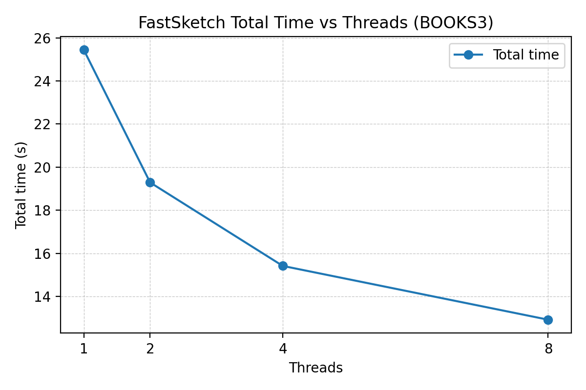

# Deduplication Comparison Experiments

We benchmark end-to-end deduplication speed with two experiments: (1) single-threaded comparisons of FastSketch versus Rensa across cached HuggingFace datasets, and (2) a FastSketch thread-scaling sweep that varies OpenMP threads from 1 to 8. Both measurements include sketching, LSH build, and querying so readers can inspect true wall-clock performance.

## Speed Highlights

All runs were executed on an AMD EPYC 7352 host with 200&nbsp;GB RAM;

### Single-Thread Comparison (FastSketch vs Rensa)
All timings exclude dataset loading/tokenisation. Totals sum the sketch, build, and query phases; FastSketch query time corresponds to the CSR batch path (`query_batch` in the logs). The `BOOKCORPUSOPEN` measurements reuse prior output from `comparison/logs/bookcorpusopen_103625.log`.

| Dataset | Engine | Sketch (s) | Build (s) | Query (s) | Total (s) | FastSketch Sketch Speedup | FastSketch Total Speedup |
|---------|--------|------------|-----------|-----------|-----------|--------------------------|------------------------|
| BOOKCORPUSOPEN | rensa | 198.545 | 0.026 | 0.018 | 198.589 | - | - |
| BOOKCORPUSOPEN | fastsketch | 55.280 | 0.039 | 0.031 | 55.350 | 3.59× | 3.59× |
| BOOKS3 | rensa | 95.915 | 0.005 | 0.003 | 95.923 | - | - |
| BOOKS3 | fastsketch | 28.440 | 0.008 | 0.007 | 28.455 | 3.37× | 3.37× |
| PINECONE | rensa | 3.929 | 0.141 | 0.153 | 4.223 | - | - |
| PINECONE | fastsketch | 1.521 | 0.249 | 0.396 | 2.166 | 2.58× | 1.95× |
| SHUYUEJ | rensa | 3.749 | 0.037 | 0.044 | 3.830 | - | - |
| SHUYUEJ | fastsketch | 1.132 | 0.093 | 0.121 | 1.346 | 3.31× | 2.85× |

### FastSketch Thread Scaling (BOOKS3)
- Total time drops from `25.442s` at one thread to `12.921s` at eight threads, with sketching dominating the gains.
- Build and query stages remain sub-millisecond relative to sketching, so the curve follows sketch throughput.
- Scaling is not perfectly linear because the sketch kernel still contends for shared resources (NUMA bandwidth, Python dispatch, OpenMP scheduling). We will profile these bottlenecks and revisit NUMA-aware batching as future work.



## Reproducing the Experiments

### Environment Setup
- Install the native FastSketch extension: `cd fastsketchlsh_ext && pip install .`
- Install Python dependencies: `pip install -r requirements.txt`
- (Optional) Set `data/huggingface_cache` or another writable directory to reuse HuggingFace downloads.

### Automation Scripts
- `comparison/run_all_comparisons.sh` runs both engines on the configured dataset list (currently `PINECONE`, `SHUYUEJ`, `BOOKS3`; `BOOKCORPUSOPEN` is commented out). The script enforces single-threaded FastSketch, parses timing lines, and prints the Markdown table above.
- `comparison/fastsketch_thread_sweep.sh DATASET` benchmarks FastSketch with thread counts `{1, 2, 4, 8}`, logging JSONL timings and saving the scaling plot in `comparison/results/`.

Activate the project virtual environment before executing either script:

```bash
cd <project-root>
source .venv/bin/activate
bash comparison/run_all_comparisons.sh
```

### Manual Runs
1. Launch the driver with your chosen engine and dataset:
   ```bash
   python -m comparison.run --engine fastsketch --dataset PINECONE
   ```
   Valid `--engine` values are `fastsketch` and `rensa`, and datasets accept either enum (`PINECONE`, `SHUYUEJ`, etc.) or full HuggingFace IDs.
2. The script shuffles the dataset, tokenises documents into 3-gram shingles, sketches them, builds the LSH index, and reports duplicate counts plus per-stage timings.
3. If direct HuggingFace access is slow, add `--use-hf-mirror` or `--hf-endpoint https://hf-mirror.com`.

### Recording Deduplication Times
- Each run ends with a summary line such as `FastSketchDeduplicator: sketch=0.215, build=0.051, query_batch=0.041`.
- Store the printed timings together with the command line to ensure reproducibility.

### Working With Cached Data
- Tokenised datasets live under `comparison/processed_ds/` once generated; subsequent runs reuse them to skip downloads.
- Delete the cached files if you need to regenerate preprocessing (e.g. for a new split or n-gram size).