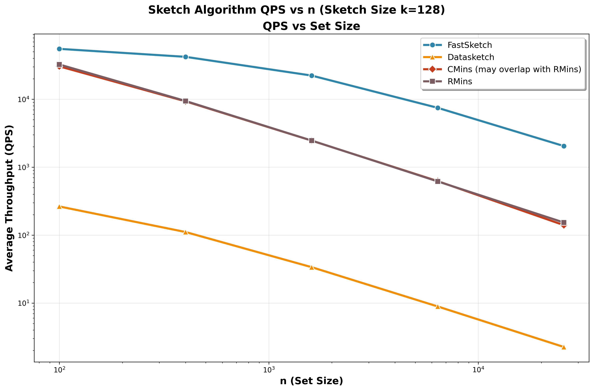

# Sketch Comparison Experiments

This document summarises the benchmarking campaign run by `compare_sketch.py`, which compares four locality-sensitive sketch implementations on synthetic interval sets with controlled Jaccard overlap. The script sweeps sketch sizes `k ∈ {64, 128, 256}` and set sizes `n ∈ {100, 400, 1 600, 6 400, 25 600}`, recording both estimation error and wall-clock time. Each configuration is averaged over 50 trials to smooth variance. The experiment studies the following algorithms:




- `FastSimilaritySketch` (O(n + k log k) expected time, O(k) space)
- `DatasketchMinHashSketch` (O(k · n) time, O(k) space)
- `CMinHashSketch` (O(k · n) time, O(k) space)
- `RMinHashSketch` (O(k · n) time, O(k) space)

Outputs are written to `records/sketch_comparison_results.csv` and can be visualised with the helper scripts in the same directory.

## Result Snapshot

Overall trends (full numbers in the CSV):

- `FastSimilaritySketch` sustains **sub-millisecond** sketching even for `n = 25 600`, while keeping the absolute Jaccard error in the **0.02–0.06** range.
- `DatasketchMinHashSketch` matches FastSimilaritySketch on accuracy but is roughly **200×–990×** slower across the sweep because each update performs `k` hash evaluations in Python.
- `CMinHashSketch` shows higher error for small sets (up to **≈0.30** when `n = 100`) before narrowing the gap as `n` grows, while `RMinHashSketch` stays closer to FastSimilaritySketch but still trails in most settings. Both remain **8×–23×** slower than FastSimilaritySketch due to repeated native initialisation costs.
- Speedup factors (`fast_speedup_vs_*`) scale with `n` and `k`, highlighting the advantage of the SIMD-heavy implementation as workloads get larger.

Illustrative slice (`k = 128`, `n = 6 400`):

| Algorithm | Avg. Jaccard Error | Avg. Time (s) |
| --- | --- | --- |
| FastSimilaritySketch | 0.0364 | 1.34×10⁻⁴ |
| DatasketchMinHashSketch | 0.0385 | 1.12×10⁻¹ |
| CMinHashSketch | 0.1246 | 1.61×10⁻³ |
| RMinHashSketch | 0.0379 | 1.62×10⁻³ |

Visual artefacts generated from the CSV include:

- `records/minhash_QPS_vs_k_n1000.png` — throughput versus sketch size (fixed `n = 1 000`).
- `records/minhash_QPS_vs_n_k128.png` — throughput versus set size (fixed `k = 128`).

## Reproducing the Experiment

1. Install dependencies as described in the repository `README.md` (build the native extension and set up your Python 3.12 environment).
2. Activate the project virtual environment (for example `source .venv/bin/activate`, adjusting the path to match your setup).
3. Navigate to this directory:
   ```bash
   cd /common/users/zp128/FastSketchLSH/exps/sketch
   ```
4. Run the benchmark:
   ```bash
   python compare_sketch.py
   ```
5. Find the raw results in `records/sketch_comparison_results.csv`. Reuse `records/plot_comparison_results.py` or your own tooling to regenerate the figures.

Key Points:
- FastSimilaritySketch keeps Jaccard error comparable to baselines while running 200×–990× faster.
- Datasketch remains accurate but is bottlenecked by per-item hashing in Python.
- Rensa-based baselines converge in accuracy for large `n` yet stay 8×–23× slower.
- Re-run by activating the project environment and executing `compare_sketch.py` inside `exps/sketch`.

